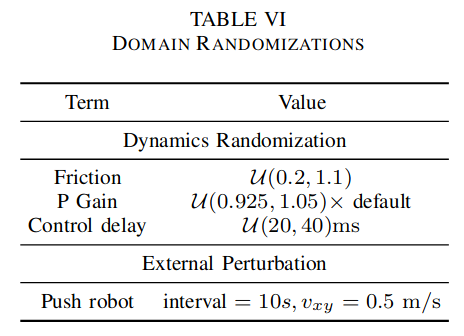
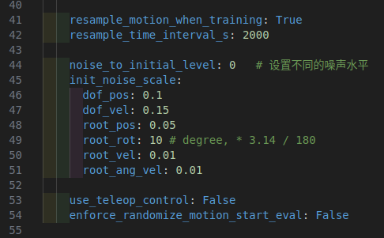

<h1 align="center"> ASAP项目的相关deploy
</h1>

# 准备工作
## Conda环境安装
创建 conda 环境

```bash
conda create -n unitree python=3.8
conda activate unitree
```

安装 Pytorch

```bash
conda install pytorch==2.3.1 torchvision==0.18.1 torchaudio==2.3.1 pytorch-cuda=12.1 -c pytorch -c nvidia
```

安装 unitree_sdk2_python

```bash
git clone https://github.com/unitreerobotics/unitree_sdk2_python.git
cd unitree_sdk2_python
pip install -e . && cd ..
```

安装 isaac_utils

```bash
pip install -e isaac_utils/
```

安装其余依赖

```bash
pip install -r requirements.txt
```

测试

```bash
python deploy_mujoco/sim2sim.py
```

使用上述命令, 可以在 mujoco 中完成 siuu! 的相关动作

# 流程说明

强化学习实现运动控制的基本流程为：

`Train` → `Play` → `Sim2Sim` → `Sim2Real`

- **Train**: 通过 Gym 仿真环境，让机器人与环境互动，找到最满足奖励设计的策略。通常不推荐实时查看效果，以免降低训练效率。
- **Play**: 通过 Play 命令查看训练后的策略效果，确保策略符合预期。
- **Sim2Sim**: 将 Gym 训练完成的策略部署到其他仿真器，避免策略小众于 Gym 特性。
- **Sim2Real**: 将策略部署到实物机器人，实现运动控制。

## 1. 训练得到策略网络
### ASAP 训练

ASAP 项目使用动作文件(`*.pkl`)进行模仿学习, 在训练的配置文件设置中, 为保证策略具有一定的鲁棒性, 并成功部署, 主要关注以下两点:

- **域随机化设置**: 在 ASAP 的论文中, 使用了域随机化的设置进行相关训练, 其中关键参数为 push_robot, 可以增加机器人的鲁棒性
- **初始化噪声设置**: 在上述动作策略训练完毕后, 在 mujoco 中部署时, 如果设置了动作初始化, 机器人可以顺利完成动作, 但串联动作或 default_angles 进入策略部署时, 会出现机器人站立不稳定的情况, 可以设置 ASAP 项目中`ASAP/humanoidverse/config/env/motion_tracking.yaml`文件中的`noise_to_initial_level`, 从而训练机器人对初始关节角度噪声的鲁棒性.

<div align="center">
  

</div>

### 导出网络

在 ASAP 项目中, 训练好相关的模型后, 使用`eval_agent.py`文件, 会在`logs/MotionTracking/XXX/exported/`目录下生成 onnx 策略文件, 该文件是使用 onnx 网络进行的策略实现, 可以实现较为高效的推理过程.

## 2. 策略部署
### 策略部署 mujoco(sim2sim)
通过以下命令将训练好的策略网络部署至 mujoco 中
```bash
python deploy_mujoco/sim2sim.py --motion_file [MOTION_FILE_PATH] --policy [POLICY_PATH]
```

参数说明:
- `--motion_file`: 加载动作文件(`*.pkl`), 可以获取到动作长度;
- `--policy`: 加载onnx策略文件, 根据当前时刻输入的`obs`矩阵, 推理得到`action`输出, 从而让机器人做出相应动作.

示例:
```bash
python deploy_mujoco/sim2sim.py --motion_file policy/bend_pick_up/bend_pick_box_up.pkl --policy_path policy/bend_pick_up/16000/model_16000_init_noise_1.0.onnx
```
运行上述示例可以得到机器人弯腰拿东西的仿真.

### 策略部署实机(sim2real)
#### mujoco 仿真验证
由于时机(实机)未到, 目前可以使用 unitree_mujoco 项目, 将 deploy_real 的代码进行仿真验证, 时机成熟时可以部署到G1上.

测试
```bash
# 启动 mujoco 仿真环境
python deploy_real/simulate_python/unitree_mujoco.py
# 重新打开一个终端, 执行以下命令
python deploy_real/deploy_real.py
```

验证策略部署实机效果:

```bash
# 启动 mujoco 仿真环境
python deploy_real/simulate_python/unitree_mujoco.py
# 重新打开一个终端, 执行以下命令
python deploy_real/deploy_real.py --net [NET_INTERFACE] --motion_file [MOTION_FILE_PATH] --policy [POLICY_PATH]
```

参数说明:
- `--net`: 设置连接网口, 机器人的网口可以使用`ifconfig`命令进行查看, `lo`是指本机地址, 即`localhost`. 有关连接实体机器人的相关设置, 请见官方文档: [G1快速开发](https://support.unitree.com/home/zh/G1_developer/quick_development)
- `--motion_file`: 加载动作文件(`*.pkl`), 可以获取到动作长度;
- `--policy`: 加载onnx策略文件, 根据当前时刻输入的`obs`矩阵, 推理得到`action`输出, 从而让机器人做出相应动作.

示例:
```bash
python deploy_real/simulate_python/unitree_mujoco.py
python deploy_real/deploy_real.py --net lo --motion_file policy/bend_pick_up/bend_pick_box_up.pkl --policy_path policy/bend_pick_up/16000/model_16000_init_noise_1.0.onnx
```
运行上述示例可以得到机器人弯腰拿东西的 mujoco 验证.

**备注:**

1. 在启动 unitree_mujoco.py 文件后, 由于电机没有输入信号, 故设置了 ElasticBand 使用键盘上的7、8、9按键即可对绑带进行控制: 7-上升, 8-下降, 9-启停绑带.
2. 为在 mujoco 中部署 deploy_real.py 的代码, deploy_real.py 文件中有关手柄操作的代码已被注释, 为保证操作的安全性和便捷性, 建议对比官方 deploy_real 的代码, 增加手柄操作一项.

#### 部署实机
- **启动用法**: 直接运行下述命令, 可以将策略部署至实机上.
    ```bash
    python deploy_real/deploy_real.py --net [NET_INTERFACE] --motion_file [MOTION_FILE_PATH] --policy [POLICY_PATH]
    ```
- **启动过程**:
1. 启动机器人: 将机器人在吊装状态下启动，并等待机器人进入 `零力矩模式`
2. 进入调试模式: 确保机器人处于 `零力矩模式` 的情况下，按下遥控器的 `L2+R2`组合键；此时机器人会进入`调试模式`, `调试模式`下机器人关节处于阻尼状态。
3. 连接机器人: 使用网线连接自己的电脑和机器人上的网口。修改网络配置如下

    

    然后使用 `ifconfig` 命令查看与机器人连接的网卡的名称。网卡名称记录下来，后面会作为启动命令的参数

    

4. 启动程序: 假设目前与实物机器人连接的网卡名为`enp3s0`.以G1机器人为例，执行下面的命令启动

    ```bash
    python deploy_real/deploy_real.py --net enp3s0
    ```

    **注意!!!**: 在进行实机部署之前, 需将`deploy_real.py`文件中关于手柄控制的代码进行释放和修改, 如此会更加安全。
    
    - 零力矩状态: 启动之后，机器人关节会处于零力矩状态，可以用手晃动机器人的关节感受并确认一下。
    - 默认位置状态: 在零力矩状态时，按下遥控器上的`start`按键，机器人会运动到默认关节位置状态。在机器人运动到默认关节位置之后，可以缓慢的下放吊装机构，让机器人的脚与地面接触。
    - 运动控制模式: 准备工作完成，按下遥控器上`A`键，机器人此时会原地踏步，在机器人状态稳定之后，可以逐渐降低吊装绳，给机器人一定的活动空间。
    - 退出控制: 在运动控制模式下，按下遥控器上 `select` 按键，机器人会进入阻尼模式倒下，程序退出。或者在终端中 使用 `ctrl+c` 关闭程序。

